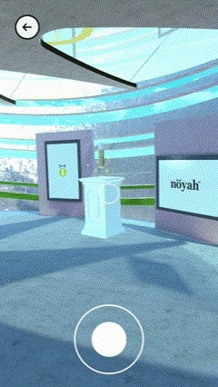

An augmented-reality product exhibit I developed for a client in 2021 using Unity AR Foundation. Users enter the exhibition area through a portal door into a rustic village, displaying the consumer products in a fantasy environment:  

Additional updates and changes were made to the exhibition area, opting for a brighter and more modern look. Users could:  
-Move around either physically or using a d-pad  
-Gaze at an AR product to show a menu with more information 
-Tap the screen to interact with AR menus  
-Gaze at the spots on the floor to quickly teleport  

